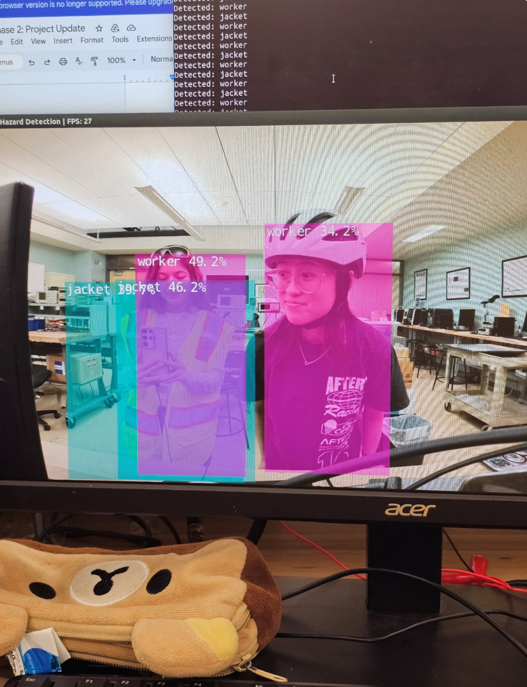
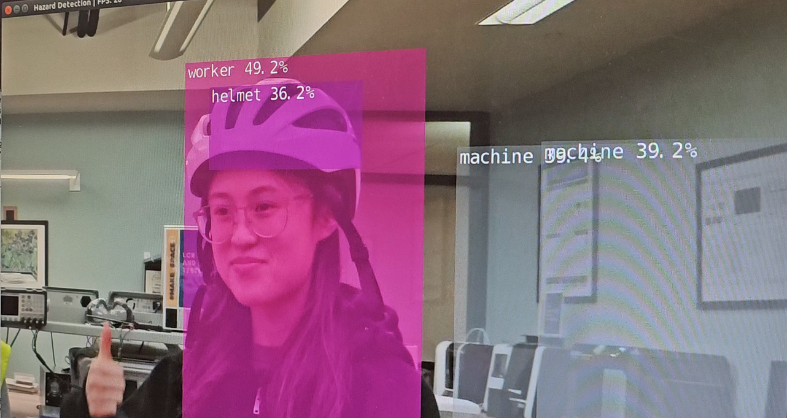
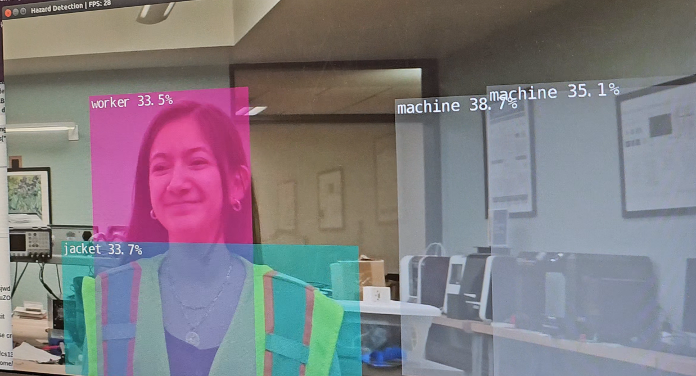
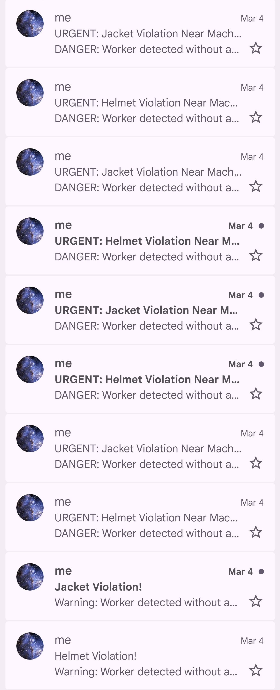
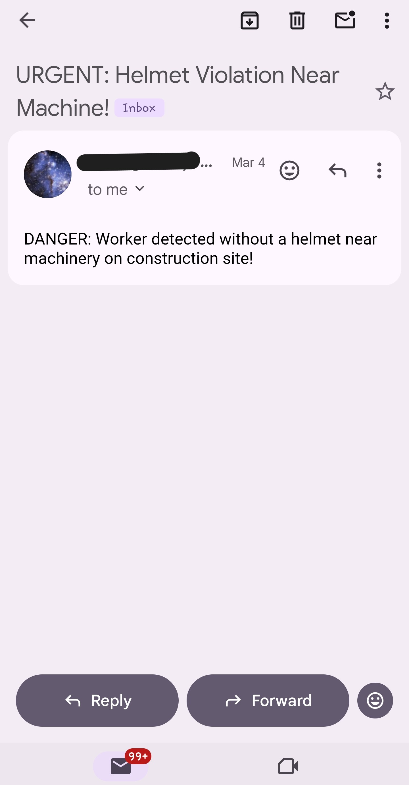
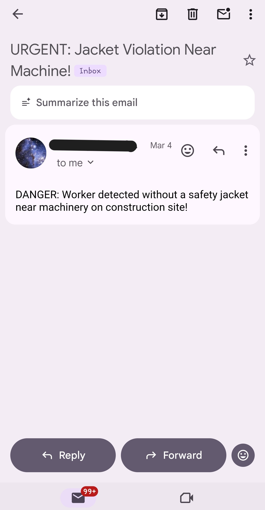

# Final-Project-Edge-Computing-CS131
# Developers: Jade Someda and Tanya Carillo
This final project is an implementation of a Smart Monitoring System for Industrial Sites.
In the case a hazard is detected, a message will be sent from the Jetson Nano to Gmail via Cloud Messaging Services.

## Architecture & Design/Implementation:
Jetson Nano Developer\
Web-Camera\
Phone (iOS/Android)\
USB-A to USB-C Converter\
Google Cloud Service (Workspace - Gmail)\
Messaging Pattern - Event-Driven\
Communication Protocol - Simple Mail Transfer Protocol (SMTP)\
Jetson Inference: DetectNet - AI/Object Detection\
Swap Space - Virtualize memory to have more space to store Epochs.\

### Design Reasoning: 
While Wireless Communcation is the main power consumer for Edge-Devices, it is neccesary for our device to use Wireless Communication/Cloud services. Otherwise, without wireless communcation the manager would have to constantly be at the site of the Jetson-Nano which defeats the System's purpose of convinience(the manager does not need to be there). 

## Training Model:
Framework: PyTorch\
Architecture: SSD (Single Shot Detector)\
Neural Network: Convolutional Neural Network (CNN)\
Activation Function - ReLU/ReLU6\
Loss Function - SmoothL1/CrossEntropy\
Backbone: VGG/MobileNet/SqueezeNet\
Optimizer: SGD

# Resources:
Roboflow Universe for our Dataset (Image Format: Pascal VOC XML)

# Challenges
* 5-year-old SD card led to significant training time, taking twice as long as anticipated.
* We had not trained a model before and had to learn quite a lot, which slowed our process. (Organizing the correct directories, choosing a good dataset, ensuring 1:1 ratio between XML/JPEG files, etc.)
* Time Constraint: Completed this in 3 weeks. ~50 Hours of Time Spent on this project. 
* We planned to use Push-Notification/Event-Driven Messaging Pattern with Firebase (HTTPS), but we were unable to generate a token (used to communicate between the cloud and phone), so we switched to SMTP (i.e. using Gmail as the messaging protocol).
* We were running low on RAM and Disk Space. Our Disk Space was so low that the Edge Device's ability to keep track of time was off, and our CPU was so overloaded/RAM extremely low that our mouse stopped being able to click icons on the screen. We had to delete unnecessary files to resolve the Disk Space issue, and we virtualized RAM memory by using Swap Space to resolve the low RAM.

### General Workflow - How to Train AI Model 
1) Set up Docker environment. (Build Dockerfile, build an image with all the neccesary packages(firebase admin, detectnet,etc).
   * Make sure the Dockerfile is so that the container can be resumed and not deleted each time you closed out. Otherwise you will need to keep donwnloading packages over and over/progress is not saved. We made this mistake! 
2) Get Diverse & Large Dataset (Pre-Labeled)
  * If you sourced multiple datasets: Compile them into one dataset.
3) Verify both XML & JPEG files are not corrupted
4) Verify there is a 1:1 ratio betwen XML/JPEG files.
5) Create Directories to organize files. Seperate between JPEG/XML.
6) Find out all the labels across all files and compile them all into one labels.txt. Labels are the names of the specific objects you want the model to identify. 
7) Create a train file, that feeds the dataset into the jetson-inference module to learn. And make sure it saves ephocs at specific directory.
8) Execute train file. Train the model. 
9) Create Trigger File. (the middleman that calls detectnet, the cloud services, generates the custom messages ).
10) Generate token and place that in trigger file(if using Firebase/HTTPS; not needed for STMP/ex. gmail)
11) Run the Smart System.
12)  Done!

  
# Reflection:
We successfully were able to train a model with a dataset of 500+ images, with 40 Epochs and a batch size of 2. Our Webcamera was our vision system, and the Jetson Nano was able to detect our labels with the training. Once a label was detected, the codebase would trigger communication to Google Cloud, which would then send a notification/message using Gmail and the message was viewd on a phone. 
\
\
For instance: If a worker was detected not wearing a helmet, a message regarding this hazard was sent.
\
\
We saw the versatility of this device, since current Safety Surveillance is often reliant upon human error — watchmen watching various cameras, or up to the supervision of upper-management faculty who can only see so much at once. Our vision for this project was that multiple Smart Monitors can be placed on site to be the "extra pair" of eyes. Once a hazard is detected, the manager can simply see the notification and proceed as necessary.
\
\
Overall, this project was interesting and we learned quite a lot about AI/ML training and working with Edge Devices.

# Demo
-------------------------------------------------------------------------------------------------------------------------------------------------------------
Link to the video demo: https://youtu.be/mRhUXtfdJh4 

## Detection in Action

## Alert Notification

